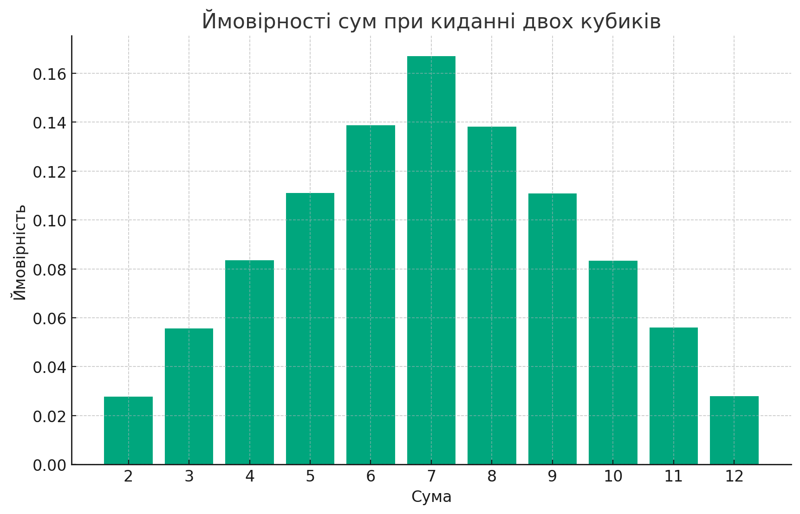

Симуляція кидання двох кубиків була проведена мільйон разів, і результати були наступними:

Сума: 2, Ймовірність: 2.77%

Сума: 3, Ймовірність: 5.57%

Сума: 4, Ймовірність: 8.34%

Сума: 5, Ймовірність: 11.11%

Сума: 6, Ймовірність: 13.88%

Сума: 7, Ймовірність: 16.70%

Сума: 8, Ймовірність: 13.82%

Сума: 9, Ймовірність: 11.08%

Сума: 10, Ймовірність: 8.34%

Сума: 11, Ймовірність: 5.60%

Сума: 12, Ймовірність: 2.79%

Ці результати дуже наближені до теоретично обчислених ймовірностей, що демонструє точність методу Монте-Карло для великої кількості спроб. Наприклад, теоретична ймовірність випадання суми 7 є 16.67%, і в симуляції вона склала 16.70%, що є дуже близьким результатом.

Ці результати також були візуалізовані у вигляді стовпчикової діаграми, яка показує ймовірності відповідних сум.

